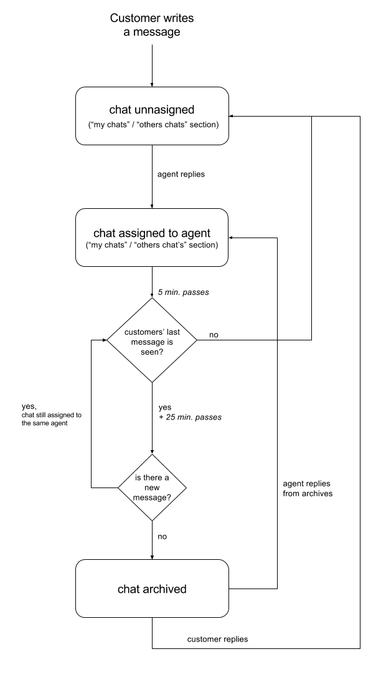

# Chat Routing

Routing is the process of **assigning chats to agents**. The primary goal of the routing mechanism is to distribute chats to all available agents at a single license .

This section describes LiveChat default product routing. In the future it will be possible to create a custom routing mechanism and run it on LiveChat platform.

In LiveChat it's not possible for a customer to have multiple chats within a single license. The conversation within a license (i.e. a company) is continuous from the customer's perspective and it's not necessary to split it into multiple chats.

Agents are assigned chats **either automatically or manually**, depending on the routing settings.

## Automatic routing

## Manual routing

## System messages

While the routing switches states (as shown in the diagrams above), the router will send system messages (see [Events](#system-message) section) to a chat.

###  Overview

| Message text | System message type |
|--------------|---------------------|
| `Chat is unassigned because <agent_name> hasn't replied in <minutes_number> minutes` | `routing.unassigned` |
| `Chat assigned to <agent_name> because <agent_name> hasn't replied in <minutes_number> minutes` | `routing.assigned` |
| `Chat archived due to long inactivity` | `routing.archived` |
| `Chat is idle due to <minutes_number> minutes of inactivity` | `routing.idle` |
| `Chat archived because customer was banned by <agent> for N days` | `customer_banned` |

### System messages: rounting.assigned

#### General info

| Message text | System message type |
|--------------|---------------------|
| `Chat assigned to <agent_name>` | `routing.assigned` |

#### Use cases

| Case| Routing type |
|--------------|---------------------|
| A new chat is started and an agent is available | automatic |
| An agent has left the chat and another agent is available | automatic |
| An agent got available for an unassigned chat | automatic |

### System messages: rounting.unassigned

#### General info

| Message text | System message type |
|--------------|---------------------|
| `Chat is unassigned` | `routing.unassigned` |

#### Use cases

| Case| Routing type |
|--------------|---------------------|
| An agent has left the chat and there were no other agents are available | automatic |
| No free agent slots available | automatic |
| A chat is unassigned | manual |

